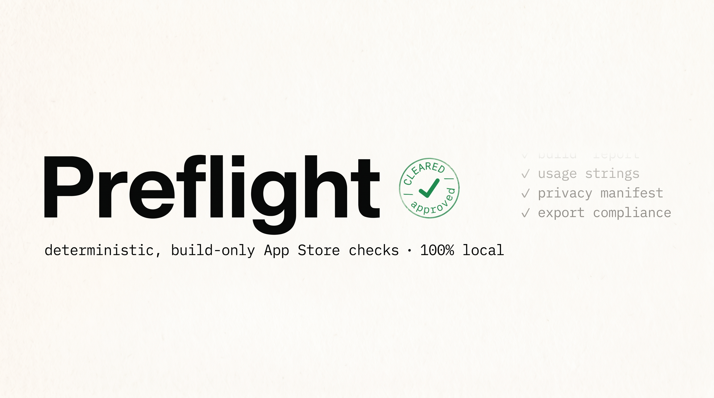
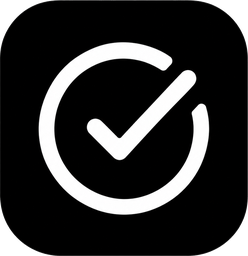

<p align="center">
  
</p>

<p align="center">
  <strong>Parse an iOS build artifact and run deterministic, build-only App Store checks — 100% local.</strong>
</p>

<p align="center">
  
  
  
  
</p>

Preflight is a small Swift library (plus a thin CLI) that opens an iOS build
(`.ipa` or `.xcarchive`), extracts structured **facts** from it, and runs a set of
**deterministic checks** that catch frequent App Store review rejections *before*
you submit.

It reads files only. It never touches the network, never talks to App Store
Connect, never uses an LLM, and never executes the binary.

## What it does

1. **Parse** — opens the build, reads the app `Info.plist` (binary or XML),
   privacy manifests (`PrivacyInfo.xcprivacy`), and the `Frameworks` folder, and
   produces a `BuildFacts` value.
2. **Check** — runs six deterministic checks over those facts and returns sorted
   `Finding`s (blocker / warning / info), each with a stable code, an English
   message, and a suggested fix.

### The checks

| Code | Severity | What it flags |
|------|----------|---------------|
| `usage.empty` | blocker | A `*UsageDescription` key is present but empty (Apple rejects these). |
| `usage.placeholder` | warning | A usage string looks like a placeholder or is too short. |
| `privacy.missing` | warning | No `PrivacyInfo.xcprivacy` at the app root (required since May 2024 for required-reason APIs / third-party SDKs). |
| `encryption.missing` | info | `ITSAppUsesNonExemptEncryption` is absent — ASC re-asks the export-compliance question every upload. |
| `tracking.empty` | blocker | `NSUserTrackingUsageDescription` is present but empty (the ATT prompt needs text). |
| `tracking.noATT` | blocker | A manifest declares tracking but there is no ATT usage string. |
| `collectedData.declare` | warning | The build embeds manifests that declare collecting data types — a reminder to verify your App Privacy labels. **Informative only**: Preflight does not read your ASC labels, so it never claims anything is "missing" from them. |

## Install

Swift Package Manager — add the dependency:

```swift
.package(url: "https://github.com/Sakaax/preflight.git", from: "1.0.0")
```

```swift
.target(name: "YourApp", dependencies: [
    .product(name: "Preflight", package: "preflight")
])
```

Build the CLI from a checkout:

```bash
swift build -c release
.build/release/preflight /path/to/MyApp.ipa
```

## Library usage

```swift
import Preflight

let url = URL(fileURLWithPath: "/path/to/MyApp.xcarchive")
let (facts, findings) = Preflight.inspect(at: url)

print(facts.bundleId ?? "—")
for finding in findings {
    print("[\(finding.severity)] \(finding.title): \(finding.message)")
}
```

You can also compose your own engine:

```swift
let facts = BuildParser.parse(at: url)               // or parse(at:format:extractor:extractIcon:)
let findings = CheckEngine.buildOnly.run(facts)
```

## CLI usage

```bash
# Readable report
preflight /path/to/MyApp.ipa

# Machine-readable JSON ({ facts, findings })
preflight /path/to/MyApp.ipa --json
```

The CLI is advisory: it exits `0` even when it finds blockers (so it doesn't break
your build by itself). It only exits non-zero when the path doesn't exist.

## Guarantees

- **100% local.** Reads files only. **Zero network.** No telemetry.
- **No App Store Connect.** Preflight never reads your ASC metadata or privacy
  labels — the ASC cross-checks live in the closed product, not here.
- **No AI.** Every check is deterministic Swift.
- **Never executes the binary.** Temp directories used for `.ipa` extraction are
  always cleaned up.

See [`docs/security.md`](docs/security.md) for the threat model.

## Platform support

macOS-only for V1. The single platform-specific piece — unzipping an `.ipa` — is
isolated behind the `ArchiveExtractor` protocol (the macOS implementation,
`DittoExtractor`, shells out to `/usr/bin/ditto`). **Linux support is planned**:
it's a trivial swap of one conforming type. The core library is Foundation-only;
app-icon extraction is the only ImageIO-guarded bit and is opt-in.

## Relationship to Cleared



Preflight is the open-source build-parsing-and-checks core extracted from
**Cleared** ([cleared.sakaax.com](https://cleared.sakaax.com)), a closed macOS
app that helps you pass App Store review the first time. The richer features —
App Store Connect cross-checks, AI explanations, licensing — live in Cleared, not
here. Preflight on its own is genuinely useful and fully standalone.

## License

MIT © 2026 Bryan Ducrettet. See [LICENSE](LICENSE).
